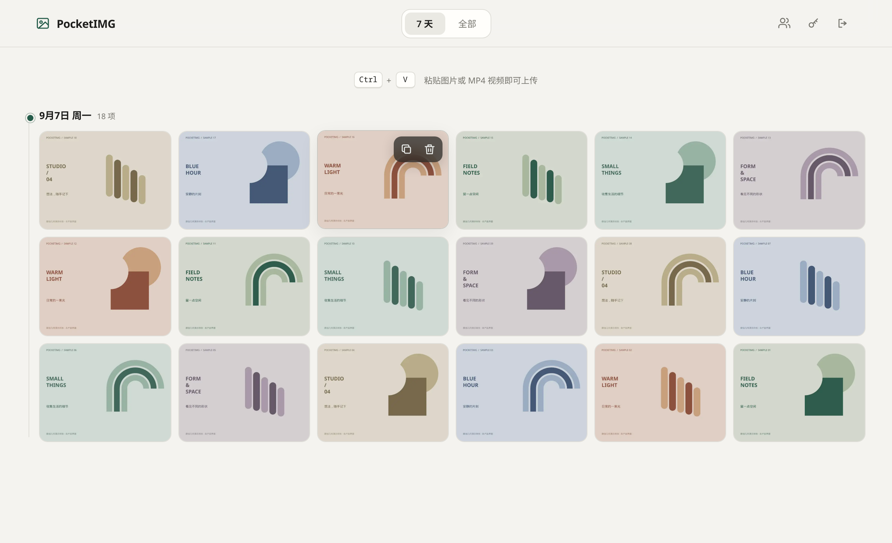
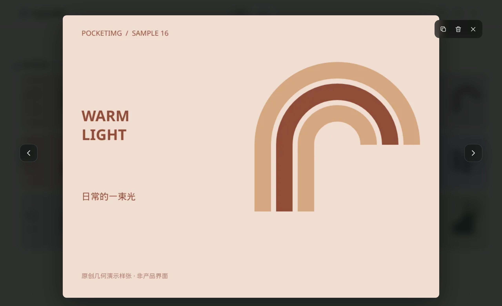
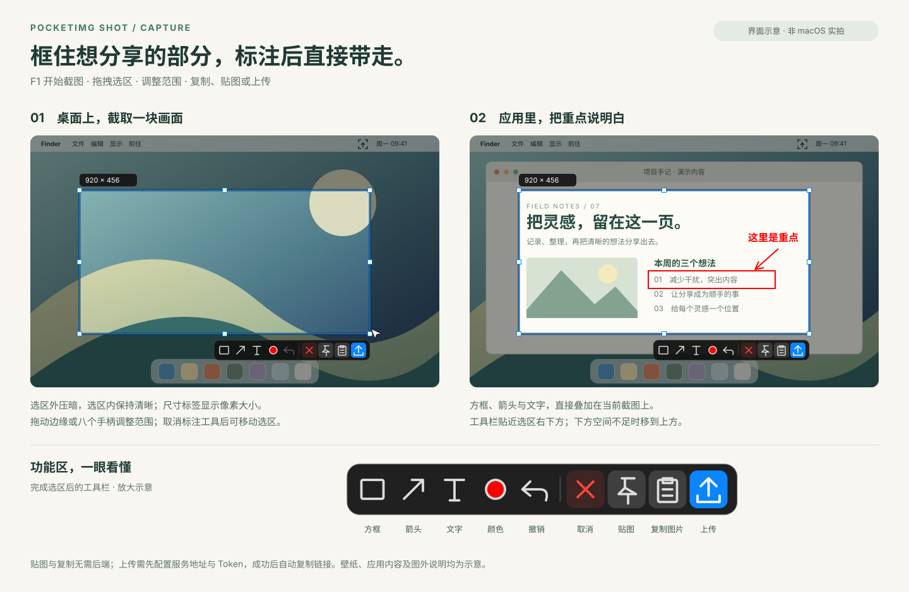
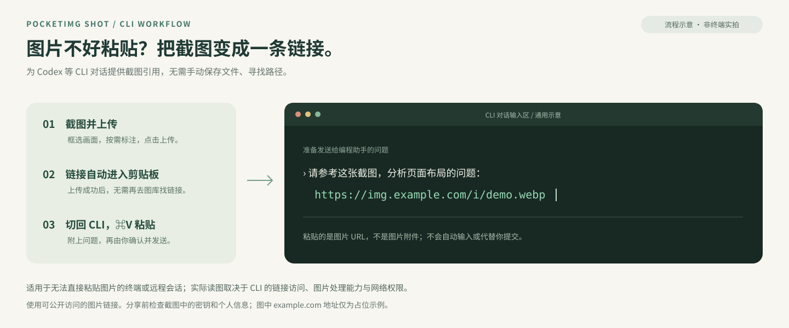

# PocketIMG

轻量自托管图床，让截图更快变成可分享的链接。

在浏览器中上传、浏览和管理图片，也可以使用 **PocketIMG Shot** 在 Mac 上截图、标注并上传，成功后自动复制分享链接。支持 Docker、Linux 和飞牛 fnOS 部署。

[部署图床](#快速开始) · [下载 Mac 截图工具](docs/macos-shot.md#下载与安装)



*真实 Web 页面截图，图库内容为专门制作的演示样张。*

## 上传、整理、分享

- **粘贴即上传**：在网页粘贴图片或 MP4 视频，查看上传进度，完成后复制公开链接。
- **集中浏览**：按日期浏览图库，切换最近 7 天或全部内容，打开图片和视频预览。
- **批量管理**：支持长按多选、桌面框选和批量删除，上传和删除后图库自动刷新。
- **独立空间**：管理员可创建用户空间，各自管理自己的图库和配额。
- **轻量部署**：网页和后端在同一个服务中运行，无需单独部署前端或外置数据库。



*真实图片预览界面；示例素材不代表额外的编辑功能。*

## PocketIMG Shot · Mac 截图工具

菜单栏常驻，用快捷键开始截图。选好区域后可以添加方框、箭头和文字，复制图片、贴图置顶，或者上传到自己的 PocketIMG 图库。



*按当前客户端实现绘制的界面示意，并非 macOS 实拍；背景应用与内容为演示素材。*

- **F1 截图**：多显示器选区、Retina 像素输出、二次调整选区。
- **标注与贴图**：方框、箭头、文字、撤销，截图可贴在屏幕上方作为参考。
- **上传后复制链接**：连接自己的图床，截图上传成功后自动复制公开 URL。
- **F2 录屏**：录制选定区域，裁剪首尾，复制或上传无音频 MP4。
- **按习惯使用**：自定义快捷键，支持中文和 English，以及应用内更新。

支持 **macOS 14+、Apple Silicon**。复制截图和贴图无需连接图床；上传需要配置服务器地址和凭证。首次使用需按系统提示授予屏幕录制权限。

[下载与安装](docs/macos-shot.md#下载与安装) · [功能和首次配置](docs/macos-shot.md)

### 把截图带进 CLI 对话

终端或远程会话不方便直接粘贴图片时，可以把截图变成链接：**截图上传 → 自动复制 URL → 切回 Codex 等 CLI 粘贴并提问**，省去手动保存图片、寻找文件路径的步骤。



应用自动复制的是图片链接，不会向终端自动输入或提交。实际读图取决于所用 CLI 的链接访问、图片处理能力及网络权限；这不是所有 CLI 都能直接识图的保证。公开链接持有者可访问图片，分享前请检查敏感内容。

## 快速开始

### Docker

主机已安装 Docker Engine、Docker Compose v2、Bash、curl、Python 3、tar 和 sha256sum，且当前用户可运行 Docker 后，直接执行：

```bash
curl -fsSL https://raw.githubusercontent.com/gmch1/pocket-img/main/install.sh | bash -s -- --docker
```

入口自动选择带 Docker 部署包的稳定 Server Release，校验 SHA-256，下载到当前目录下的 `pocketimg-docker`，拉取固定摘要的 amd64/arm64 镜像并启动服务。无需克隆源码或安装 Git、Go、Node.js，也不在用户机器上构建镜像。健康检查通过后直接显示访问地址和自动生成的登录 Token。

自定义端口和安装目录：

```bash
curl -fsSL https://raw.githubusercontent.com/gmch1/pocket-img/main/install.sh | bash -s -- --docker --port 19876 --directory ./pocketimg-docker
```

此入口需在代码发布到 `main` 且新 Server Release 带 Docker 部署包后使用；旧 `0.5.2` 镜像不支持自动初始化，不会被自动选中。升级时指定原安装目录，复用数据卷和凭证。源码构建、离线安装和备份见 [Docker 部署](docs/docker.md)。

### Linux

Linux x86_64 / systemd 主机可直接从 GitHub 安装，无需克隆仓库或安装 Go、Node.js：

```bash
curl -fsSL https://raw.githubusercontent.com/gmch1/pocket-img/main/install.sh | sudo bash
```

脚本自动选择带安装附件的稳定 Server 版本，下载并校验 SHA-256，安装 systemd 服务，启动后输出管理员 Token。主机需要 Bash、curl、Python 3 和常规 systemd 管理工具。

该入口需在本次脚本发布到 `main`，且新 Server Release 带有安装附件后使用；旧 `server-v0.5.2` 不支持，脚本不会回退安装旧版。

新安装默认只提供 `127.0.0.1:18746` 上的 **HTTP**，可自定义端口：

```bash
curl -fsSL https://raw.githubusercontent.com/gmch1/pocket-img/main/install.sh | sudo bash -s -- --port 19876
```

已有 Linux 安装保留原端口，显式传入 `--port` 才修改。Docker 也默认使用宿主机端口 `18746`，可执行 `bash scripts/install-docker.sh --port 19876` 指定。

公网 **HTTPS** 由用户配置 Nginx、Caddy 等反向代理负责，脚本不自动申请证书或开放防火墙端口。指定版本、离线安装和局域网入口见 [Linux 部署](docs/linux-amd64.md)。

### 飞牛 fnOS

安装 fnOS 应用包，从应用中心打开 PocketIMG，使用飞牛账号进入自己的图库。Mac 可通过网页引导连接同一图库。

[飞牛安装与使用](docs/fnos.md)

## 更多部署方式

也可以通过 **Android 管理 App** 在 Android 设备上运行图床后端，适合希望复用 Android 设备的用户。它是可选的服务端部署方式；手机访问已部署的图库直接使用浏览器即可。

[Android 部署与管理](docs/android-app.md)

## 使用前了解

- 图片与视频的公开链接无需登录即可访问；图库管理需要登录。
- 每个用户默认配额为 **10 GiB**，媒体默认保留 **90 天**，到期自动永久清理。重要内容应自行备份。
- 图库目前显示最近 **100 项**，尚未提供分页浏览。
- 视频上传支持无音频、单 H.264 视频轨的 MP4；Mac 录屏也不录制音频。
- Mac 暂不支持 Intel，也尚未提供马赛克、画笔、长截图或本地历史记录。
- 公网使用需自行配置域名与 HTTPS 反向代理。备份应同时保存凭证、数据库和媒体文件。

## 文档与开发

- 使用：[Mac 截图工具](docs/macos-shot.md) · [Docker](docs/docker.md) · [Linux](docs/linux-amd64.md) · [fnOS](docs/fnos.md)
- 运维：[HTTPS 反向代理](docs/reverse-proxy.md) · [组件发布](docs/releases.md)
- 开发：[本地构建](docs/development.md) · [Web 前端](docs/frontend.md) · [Spec Coding](specs/README.md)
- 其他：[Android 部署](docs/android-app.md) · [Android 开发部署记录](docs/lan-development.md) · [Root 实例迁移](docs/root-to-app-migration.md)
- 记录：[变更日志](CHANGELOG.md) · [v1 需求基线](docs/requirements-v1.md) · [技术设计](docs/technical-design-v1.md) · [后端预研](docs/backend-spike.md)
- 展示：[图片来源与复现方法](docs/assets/README.md)
